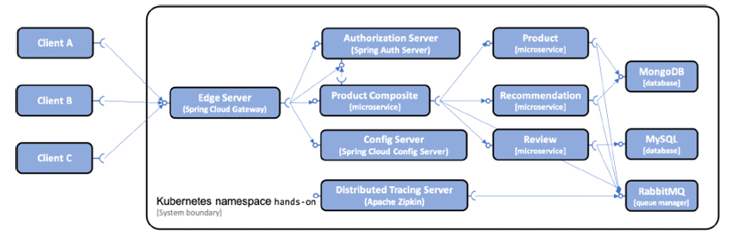

# Preliminary Notes

In this text, you will notice annotations of the form `]:topic`. These annotations can be found in the source code where the topic applies.

# Status of the Source Code

* The unit tests triggered by the build process work only outside of a Kubernetes environment. 
* Build tests & `test-em-all.bash` don't work once a Kubernetes cluster is running.
  * For `gradle build`, we get the following output:
    ```bash
    ...
    > Task :microservices:product-service:test

    PersistenceTests > getByProductId() FAILED
        java.lang.ExceptionInInitializerError at NativeConstructorAccessorImpl.java:-2
            Caused by: java.lang.IllegalStateException at RyukResourceReaper.java:132

    PersistenceTests > optimisticLockError() FAILED
        java.lang.NoClassDefFoundError at NativeConstructorAccessorImpl.java:-2
    ...        
    ```
    The `NoClassDefFoundError` is also thrown for the other tests of `PersistenceTests` and `ProductServiceApplicationTests`.
  * `test-em-all.bash` the script waits for ever to conntect to the actuator health:
    ```bash
    curl -k https://$HOST:30443/actuator/health
    ```

* ]:arm64 - Since I have a Mac M1, I'm using Docker images to support the ARM64 achitecture (see [Develop, build and deploy microservices on Apple silicon (ARM64) | Callista](https://callistaenterprise.se/blogg/teknik/2022/11/02/microservices-on-apple-silicon/)).
* ]:arm64]:mysql8 - Since version 8, some settings are required to get the mysql server successfully started.
* [me]:mapstruct - As introduced in Chapter 6, I use MapStruct to transform the model classes into entity objects. Since my Visual Studio Code has no support for creating *Mapper Implementation classes* in the bin directories, I had to include an extra step in the build process of certain `build.gradle` files.

# ]:test]:dev - Deploying to Kubernetes for development and test
<a id="deploy_and_test_id"></a>
To be able to run functional tests, we will deploy the microservices together with the
resource managers they require in the same [*Namespace*](https://github.com/hjoly2003/cribs/blob/master/Kubernetes/kubernetes_jargon.md#namespace_id), which we will call `handson`. This makes it easy to set up a test environment, but also to remove it once we are
done with it.



But prior to the deployment, we need to create a Kubernetes cluster (See [Creating a Kubernetes cluster](../Chapter15/README.md#cluster_creation_id)):
```bash
unset KUBECONFIG

minikube delete -p handson-spring-boot-cloud 

minikube start \
--profile=handson-spring-boot-cloud \
--memory=10240 \
--cpus=4 \
--disk-size=30g \
--kubernetes-version=v1.25.0 \
--driver=docker \
--ports=8080:80 --ports=8443:443 \
--ports=30080:30080 --ports=30443:30443

minikube profile handson-spring-boot-cloud
```
We can monitor the cluster initialization by issuing the following command:
```bash
kubectl get pods --namespace=kube-system
```
Now, we can perform the deployment of the microservices.
```bash
cd $BOOK_HOME/Chapter16_Init

eval $(minikube docker-env)
```
On my computer, invoking `minikube docker-env` yields the following: 
```bash
export DOCKER_TLS_VERIFY="1"
export DOCKER_HOST="tcp://127.0.0.1:49940"
export DOCKER_CERT_PATH="/Users/utilisationnormale/.minikube/certs"
export MINIKUBE_ACTIVE_DOCKERD="handson-spring-boot-cloud"
```
Continuing with the deployment...
```bash
# To get rid of previously generated helm *.tgz charts
find kubernetes -type d -name 'charts' -exec rm -fr {} +
gradle clean classes

# To copy MapStruct classes in the bin directory
gradle copyMappers
gradle build -x test && docker-compose build

# Resolving Helm chart dependencies
for f in kubernetes/helm/components/*; do helm dep up $f; done
for f in kubernetes/helm/environments/*; do helm dep up $f; done

# Verify that the dependencies for the dev-env folder
helm dep ls kubernetes/helm/environments/dev-env/

# To avoid a slow deployment process due to Kubernetes downloading Docker images run the following docker pull commands in advance
docker pull mysql:8.0.31
docker pull mongo:4.4.2
docker pull rabbitmq:3.8.11-management
docker pull openzipkin/zipkin:2.23.2

# Render the templates to see what the manifets will look like;
helm template kubernetes/helm/environments/dev-env

# If it's not your first try...
helm uninstall hands-on-dev-env
kubectl delete namespace hands-on

# Verify that the Kubernetes cluster will accept the rendered manifest by a dry run. You can verify its output in the rendered-manifests.yml file.
helm install --dry-run --debug hands-on-dev-env kubernetes/helm/environments/dev-env > rendered-manifests.yml

# To initiate the deployment...
helm install hands-on-dev-env kubernetes/helm/environments/dev-env -n hands-on --create-namespace

# Set the newly created Namespace as the default Namespace for kubectl
kubectl config set-context $(kubectl config current-context) --namespace=hands-on
```

On a different terminal, to see the Pods starting up, type

```bash
kubectl get pods --watch
```

After a while, you should get the following output:

```bash
rabbitmq-6d7466d49c-xlhwj            1/1     Running   0             69s
mongodb-bccb55966-tpdjp              1/1     Running   0             69s
config-server-6f4d6d4f65-qr8b8       1/1     Running   0             69s
gateway-5c7446d46b-2qq42             1/1     Running   1 (30s ago)   3m21s
auth-server-57f49648c7-dnqk9         1/1     Running   0             2m31s
product-784f9bc7bb-smh4n             1/1     Running   0             2m31s
recommendation-7468765d44-vvt8c      1/1     Running   0             2m31s
product-composite-6ffb8d4db8-lhw7p   1/1     Running   0             2m21s
zipkin-server-7bcbdf57d6-njjzf       1/1     Running   1 (44s ago)   2m31s
review-67ccb9ffcc-ldlxd              0/1     Running   1 (5s ago)    3m21s
mysql-7dc4845565-r96ch               1/1     Running   2 (19s ago)   69s
```

To wait for all the Pods in the *Namespace* to be ready with the command:
```bash
kubectl wait --timeout=600s --for=condition=ready pod --all
```

To see the Docker images that are used, run the following command:
```bash
kubectl get pods -o json | jq '.items[].spec.containers[].image'
```

## Testing the deployment
* ]:test]:use_k8s - The test script can either use the docker-compose exec command or the corresponding kubectl command, kubectl exec, depending on if we are running the microservices using Docker Compose or Kubernetes.
```bash
# Start by setting up an environment variable for the hostname to use.
MINIKUBE_HOST=$(minikube ip)

# Check that the actuator health can be invoked
curl -k https://$MINIKUBE_HOST:30443/actuator/health | jq
```
When "curling" the actuator, I never get any reply.
```bash
  % Total    % Received % Xferd  Average Speed   Time    Time     Time  Current
                                 Dload  Upload   Total   Spent    Left  Speed
  0     0    0     0    0     0      0      0 --:--:--  0:01:15 --:--:--     0
curl: (28) Failed to connect to 192.168.67.2 port 30443 after 75005 ms: Operation timed out
```
Then, when I start the tests...
```bash
HOST=$MINIKUBE_HOST PORT=30443 USE_K8S=true ./test-em-all.bash
```
It never completes...
```bash
HOST=192.168.67.2
PORT=30443
USE_K8S=true
SKIP_CB_TESTS=false
Wait for: curl -k https://192.168.67.2:30443/actuator/health... , retry #1 , retry #2 , retry #3 , retry #4 , retry #5 , retry #6 , retry #7 , retry #8
```
